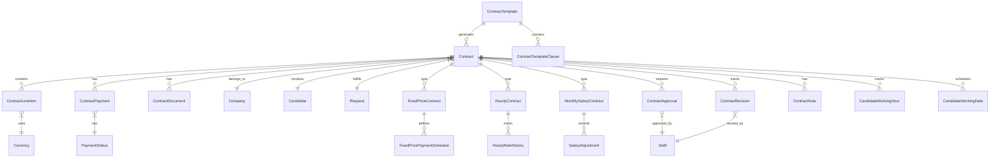
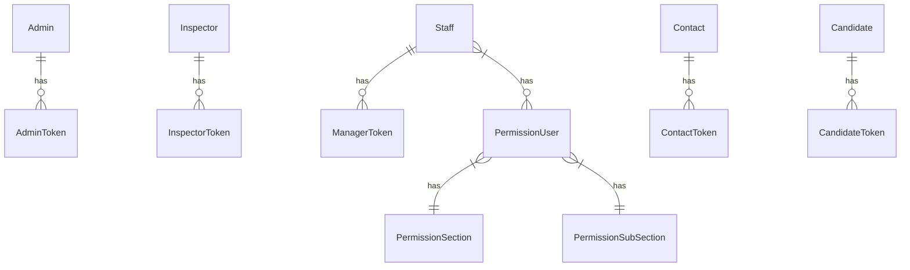

# Database Schema Documentation

## Interactive Diagram
Our database structure can be viewed and edited in our interactive diagram:
[Edit Database Diagram](https://dbdiagram.io/d/Studenthub-66e02334550cd927eabe2c68)

## Core Entity Relationships

```mermaid
erDiagram
    Candidate ||--o{ CandidateEducation : has
    Candidate ||--o{ CandidateExperience : has
    Candidate ||--o{ CandidateSkill : has
    Candidate ||--o{ CandidateWorkHistory : has
    Candidate ||--o{ RequestApplication : submits
    Candidate ||--o{ CandidateToken : has
    Candidate ||--o{ CandidateNotification : receives
    Candidate ||--o{ CandidateIdCard : has
    Candidate ||--o{ CandidateWarning : receives
    Candidate ||--o{ CandidateTag : has
    Candidate ||--o{ CandidateStats : has
    Candidate ||--o{ CandidateWorkingHour : logs
    Candidate ||--o{ CandidateWorkingDate : schedules
    Candidate ||--o{ CandidateVideoLog : has
    Candidate ||--o{ CandidateEvaluation : receives
    Candidate ||--o{ CandidateCertificate : has
    Candidate }|--|| Country : belongs_to
    Candidate }|--|| Bank : has
    Candidate }|--|| University : attended

    Company ||--o{ CompanyContact : has
    Company ||--o{ Request : posts
    Company ||--o{ CompanyStats : has
    Company ||--o{ Invoice : has
    Company ||--o{ BalanceTransaction : has
    Company }|--|| Brand : belongs_to
    Company }|--|| Country : located_in
    Company }|--|| Area : located_in

    Request ||--o{ RequestApplication : receives
    Request ||--o{ RequestInterview : schedules
    Request ||--o{ RequestSkill : requires
    Request ||--o{ RequestChecklist : has
    Request }|--|| Company : belongs_to
    Request }|--|| Staff : created_by

    Staff ||--o{ StaffExpenses : has
    Staff ||--o{ StaffLeave : takes
    Staff ||--o{ StaffSalary : earns
    Staff ||--o{ StaffNotification : receives
    Staff ||--o{ Request : manages
    Staff }|--|| Department : belongs_to
```

## Contract Management System

## Authentication & Permissions

[... rest of the existing diagrams ...] 